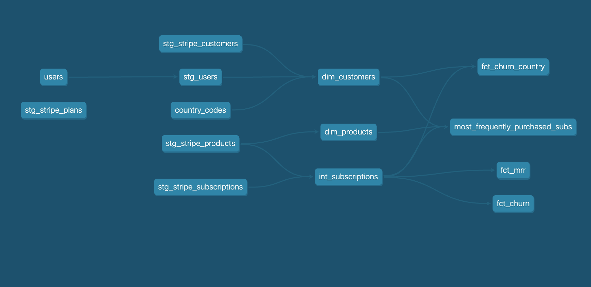
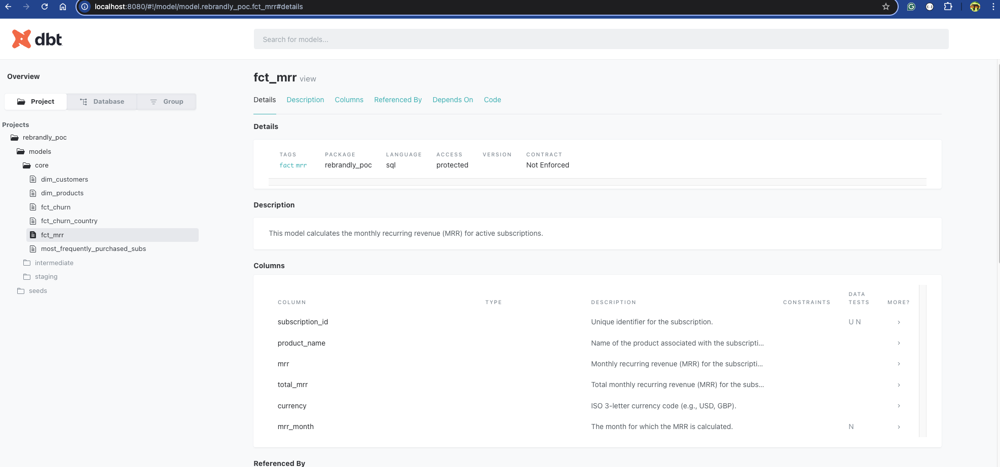

# Data Model



You can see the documentation of the data model by running the following

```shell
source .env
cd data-models
dbt seed
dbt run
```

After which you generate the Model documentation by doing the following (still from within the `data-models` directory):

```shell
dbt docs generate
```

You can now view the documentation locally by running this:

```shell
dbt docs serve
```

You should now be able to access the Documentation for the models at [http://localhost:8080](http://localhost:8080)

## KPIs

### [MRR](core/fct_mrr.sql)

There is a detailed description for each model (KPI), as well as compiled code and tests

Here is an example for MRR



The model calculates the Monthly Recurring Revenue (MRR) for active subscriptions. It first identifies active subscriptions and determines their MRR based on the amount paid if the subscription is active. Then, it aggregates this data on a monthly basis, summing up the MRR for each subscription and grouping the results by subscription ID, product name, and currency. The final output provides the total MRR for each subscription for each month.

### [Most frequently purchased subscriptions](models/core/most_frequently_purchased_subs.sql)

This model calculates the most frequently purchased subscriptions per country. It joins product, subscription, and customer data to count the number of active subscriptions for each product in each country. It then ranks the products within each country based on the purchase count. The final output provides the most frequently purchased product for each country, along with the purchase count.

### [Churn](models/core/fct_churn.sql)

This model calculates the churn count for subscriptions on a monthly basis by first selecting the relevant subscription data, including subscription ID, status, and various timestamps. It then identifies churned subscriptions based on their status (e.g., canceled, paused, unpaid). Finally, it aggregates the churned subscriptions by month, counting the number of churned subscriptions for each month. The final output provides the monthly churn count.

### [Churn per country](models/core/fct_churn_country.sql)

This model calculates the monthly churn count and total lost revenue for churned subscriptions, grouped by country. It first selects relevant subscription data, including subscription ID, product name, amount paid, currency, and various timestamps, along with the customer's country code. It identifies churned subscriptions based on their status (e.g., canceled, paused, unpaid) and calculates the lost revenue for these subscriptions. Finally, it aggregates the churned subscriptions by month and country, summing the lost revenue and counting the number of churned subscriptions for each month and country. The final output provides the monthly churn count and total lost revenue for each country.
